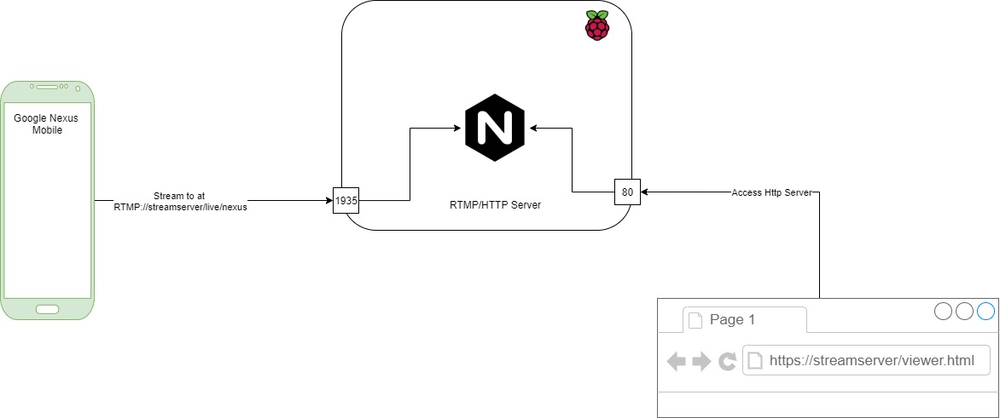

# Home Surveillance Setup
This is a weekend project with very basic functionality.

## Requirements
I do have a simple requirement to add a surveillance camera at my home to get live feed over the internet. 
You might think there are a lot of devices and services available in the market, then why? Answer is, I don't trust them.

## Devices used to full the requirement
I used raspberry pi 3 model B as a RTMP and HTTP server. RTMP accepts the live streaming feed from mobile camera over wifi and store last 30 seconds feed.
Raspberry server provides this live feed back to me using hlv http server over http protocol.

Below is the architecture diagram -  



# Prerequisite
- nginx [download][http://nginx-win.ecsds.eu/download/]
- Andoid App [Astra Streaming Studio](https://play.google.com/store/apps/details?id=miv.astudio&hl=en_IN&gl=US)

# Getting Started
 

## 1. Configure Nginx server
Nginx will be working as both ```RTMP server``` and ```HTTP server```.
> NOTE: I'm describing windows setup to make it easy. In order to run this sertup on Raspberry pi, you will need to download source code of nginx with rmpt master repo and then compile it. 

**RTMP server** will accept any broadcaster at ```/live``` path using RTMP protocol with provided key. We will use key ```nginx``` for Android stream.

**HTTP server** will provide the live feed from HLS RTMP server device using ```viewer.html``` file.
### **Download Nginx**
Download the nginx 1.7.11.3 Gryphon.zip , It has pre compiled RTMP module for windows


- Unzip to your  prefered location
```
unzip D:\nginx
```
- Copy ```srv ``` at your nginx location ```D:\nginx```
- Copy and replace ```D:\nginx\nginx.conf ``` with ```nginx.conf ```

- Start Nginx server


- Testing 
Goto ``` http://192.168.43.56/viewer.html```


## 2. Install mobile app in your mobile device
We will use ```Astra Streaming Studio``` application to stream to nginx server from Nexus mobile app.
### Configure
We will need to choose the service as RTMP server and then provide IP address with URI live and key name.
- Click on the browser icon on right hand side

- Choose RTMP , choose name and fill below details. 
Note: keep everything else as it is.


IP - ```192.168.43.56/live```

key - ```nexus```

Mobile app will automatically add ```rtmp``` protocol to it.
- Click on the Play button on bottom righ corner

Now you might be able to see a green icon, with RTMP service, which means its all working good.


Mobile app is now streaming to the nginx RTMP server. 
Congratulations , all setup now.
# Testing
If all good, you might be able to see the below feed in your browser.


# Use Laptop webcam to stream to Nginx server
You can use windows webcam to streamt to the server as well. Please download FFMPEG [official website](https://www.ffmpeg.org/), extract the zip file to the prefered location.

- Start feed from webcam
Now execute below command.
```cmd
ffmpeg -re  -f dshow -video_size 640x480 -framerate 30 -rtbufsize 2147.48M   -i video="Integrated Camera" -f dshow  -i audio="Microphone Array (Conexant SmartAudio HD)"  -profile:v high -pix_fmt yuvj420p -level:v 4.1 -preset ultrafast -tune zerolatency  -filter:v fps=fps=30 -vcodec h264_qsv  -preset fast -b:v 512k  -acodec aac -strict -2  -f flv rtmp://192.168.43.56/live/stream1
```
Note: Change the IP address to your server 
``` -f flv rtmp://192.168.43.56/live/stream1```


- Testing the live feed


